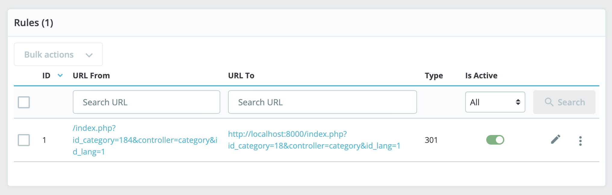

# PrestaShop Simple SEO Redirect Module

## Description

The PrestaShop Simple SEO Redirect Module is a powerful tool designed to help merchants manage and improve their online store's SEO by handling URL redirects seamlessly. This module simplifies the process of creating and managing redirects, ensuring that your customers can find the right content while maintaining a clean and search-engine-friendly website structure.

### Key Features

- **User-Friendly Interface**: A user-friendly and intuitive admin interface makes it easy for store owners to create, edit, and delete redirects without technical expertise.

- **301 and 302 Redirects**: Choose between permanent (301) and temporary (302) redirects for each URL redirection, providing flexibility to handle various scenarios.

- **No Downtime**: Ensure a seamless shopping experience for your customers by redirecting old URLs to new ones without downtime or disruptions.

- **SEO Improvement**: Maintain your website's SEO rankings by ensuring that old URLs are correctly redirected to relevant new pages, reducing the risk of 404 errors.

### Roadmap

- **Bulk Redirect Import**: Easily import bulk redirect rules from CSV files, saving time and effort when managing large sets of redirects.

- **Wildcard Redirects**: Create wildcard redirects to cover a range of URLs with a single rule, simplifying complex redirection needs.

- **Detailed Logging**: Keep track of every redirect action with a comprehensive log, including date, source URL, target URL, and redirect type.

- **Regex Support**: Advanced users can utilize regular expressions (regex) for more complex redirect patterns, providing ultimate flexibility.

## Installation

1. Download the module zip file from the [GitHub repository](https://github.com/owles/ps_redirect/releases).
2. Log in to your PrestaShop admin panel.
3. Navigate to the "Modules and Services" section.
4. Click on the "Upload a Module" button and select the zip file you downloaded.
5. Once the module is uploaded, click "Install."

## Usage

1. Access the module from the admin panel.
2. Create individual redirects or import redirects from a CSV file.
3. Configure the redirect type (301 or 302), source URL, and target URL.
4. **(not ready yet)** Optionally, use regular expressions or wildcards for more advanced redirect rules.
5. Save your changes.

## Support

If you encounter any issues or have questions about using this module, please visit the [GitHub repository](https://github.com/owles/ps_redirect) and open an issue. We are here to help!

## License

This module is licensed under the [MIT License](LICENSE.md).

Enjoy improving your store's SEO and providing a seamless experience for your customers with the PrestaShop Simple SEO Redirect Module!
